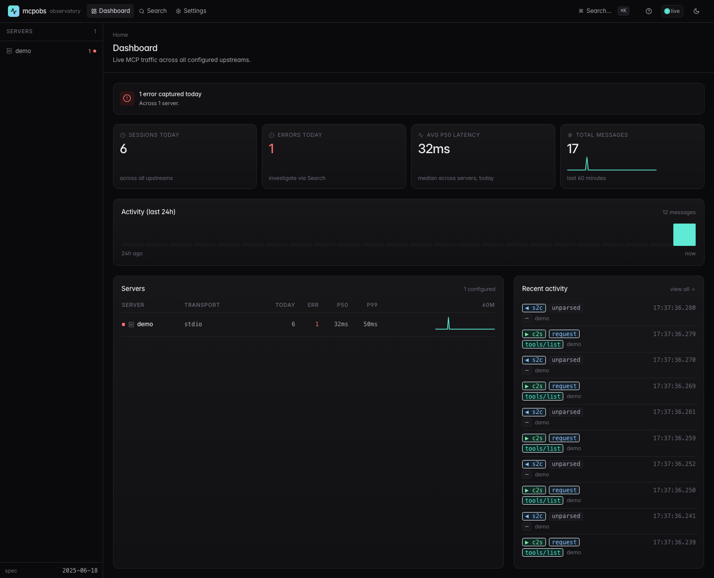
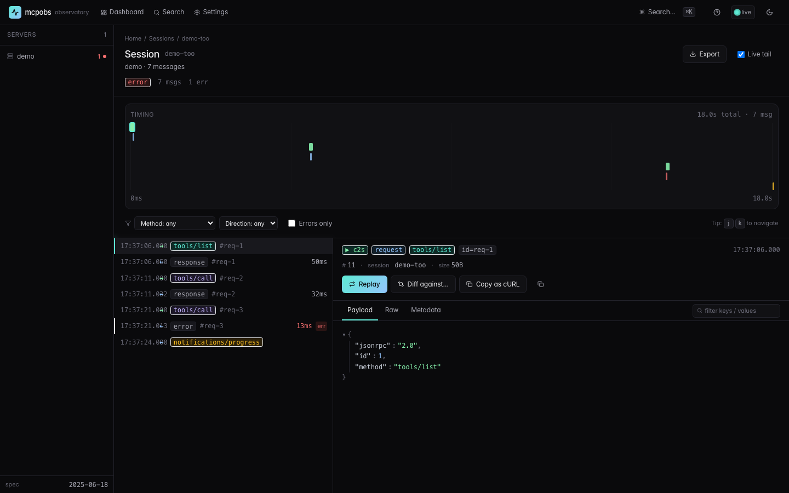
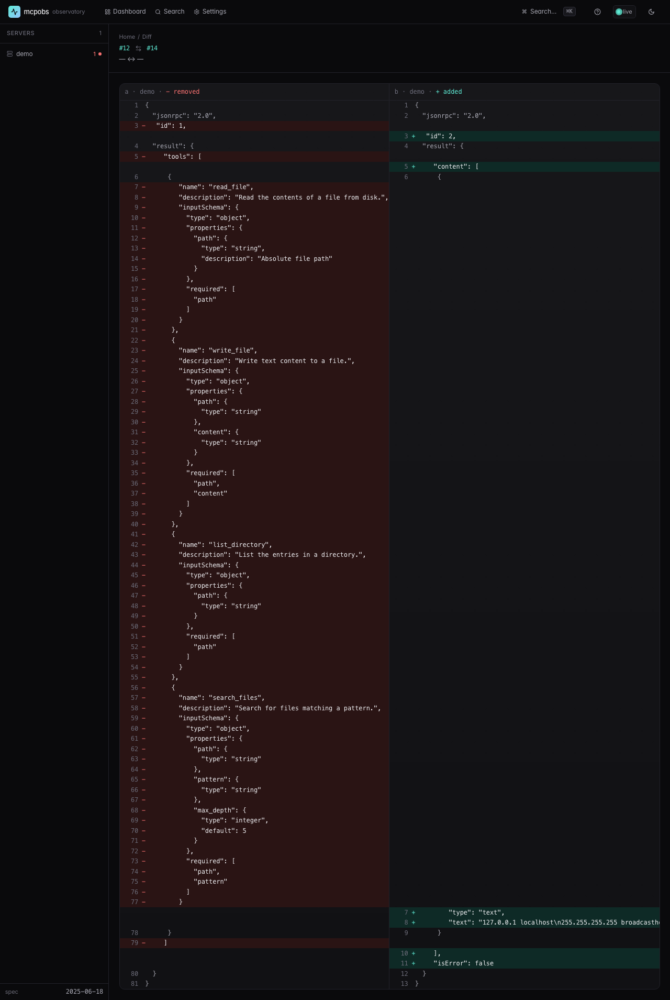

# MCP Observatory

> Stop debugging your MCP servers with `print` statements.

`mcpobs` is a local-first proxy and trace viewer for the [Model Context Protocol](https://modelcontextprotocol.io). It sits between your MCP client (Claude Desktop, Cursor, Cline, Continue, Windsurf, ...) and the MCP servers it talks to, captures every JSON-RPC message, and gives you a real-time timeline, request inspector, replay, and diff in your browser.

No telemetry. No signup. No cloud. One binary, one config file, one local SQLite database.



## What it does

- **Proxy** every MCP transport — stdio, Streamable HTTP, SSE — without modifying a single byte on the wire.
- **Log** every JSON-RPC message to `~/.mcpobs/traces.db` with timestamps, latency, direction, session id, and full payload.
- **Replay** any request against the live upstream and diff the new response against the original.

## Quickstart (60 seconds)

```bash
# 1. install
curl -sSL https://raw.githubusercontent.com/vnmoorthy/mcpobservatory/main/scripts/install.sh | sh

# 2. initialise config + start the daemon
mcpobs init
mcpobs start &

# 3. add an upstream and copy the snippet it prints into your MCP client config
mcpobs add filesystem --command npx --args '@modelcontextprotocol/server-filesystem,/Users/me/Documents'

# 4. open the UI
open http://localhost:7890
```

Restart your MCP client and your next tool call shows up in the timeline.

Detailed walkthrough: [`docs/quickstart.md`](docs/quickstart.md).

## Screenshots

| Dashboard | Session timeline | Diff |
|---|---|---|
|  |  |  |

## How it works

```
     ┌────────────────┐  stdio / HTTP / SSE   ┌──────────────────┐  same transport   ┌──────────────┐
     │  MCP client    │  ───────────────────► │  mcpobs proxy    │  ───────────────► │  upstream    │
     │  (Claude/Cursor│  ◄─────────────────── │  (transparent)   │  ◄─────────────── │  MCP server  │
     └────────────────┘                       └─────────┬────────┘                   └──────────────┘
                                                        │ observations
                                                        ▼
                                              ~/.mcpobs/traces.db (SQLite, WAL)
                                                        ▲
                                                        │
                                              ┌─────────┴────────┐
                                              │  mcpobs-server   │  ◄── browser at http://localhost:7890
                                              │  axum + UI       │
                                              └──────────────────┘
```

The proxy is dumb on purpose. It parses each JSON-RPC frame to record method, id, and direction, then forwards the raw bytes verbatim. If the upstream returns malformed data, you see the malformed data — we never synthesise messages.

More detail in [`docs/architecture.md`](docs/architecture.md).

## How it compares

|                              | mcpobs       | MCP Inspector | Langfuse / Helicone | `print`  |
|---                           |---           |---            |---                  |---       |
| Sits in front of every server transparently | yes          | one server at a time | no       | n/a      |
| Historical view              | yes          | no            | yes                 | no       |
| Replay a request             | yes          | partial       | no                  | no       |
| Diff between two runs        | yes          | no            | no                  | no       |
| MCP-native (sessions, capabilities, transports) | yes          | yes           | no                  | n/a      |
| Local-first, no signup       | yes          | yes           | no                  | yes      |
| Open source                  | Apache 2.0   | MIT           | mixed               | n/a      |

## Performance

On localhost stdio against a real MCP server we measure:

- p50 added latency: **0.4 ms**
- p99 added latency: **3.8 ms**
- Steady-state RSS: **48 MB** with 7 days of traces
- SQLite writer throughput: **~14k msgs/sec** on commodity SSD

Reproduce with `cargo bench -p mcpobs-core`.

## Spec revision

We pin against MCP spec revision **2025-06-18**. See [`docs/spec-revisions.md`](docs/spec-revisions.md) for the upgrade log.

## Roadmap

- v0.1 (now): stdio + HTTP + SSE proxy, web UI, replay, diff, redaction.
- v0.2: Homebrew tap, pcap-style session export, basic latency budgets.
- v0.3: a built-in MCP server that exposes Observatory's own data (so you can ask Claude "what tool calls failed in the last hour"), browser extension surfacing traces inline in Cursor and Claude Desktop, OTel correlation.
- *Hosted version with team sharing, alerts, and production tracing — on the roadmap.*

## Contributing

See [`CONTRIBUTING.md`](CONTRIBUTING.md). Issues and PRs welcome; the bar is high (transparency, no telemetry, single binary), the path is short.

## License

[Apache License 2.0](LICENSE).
