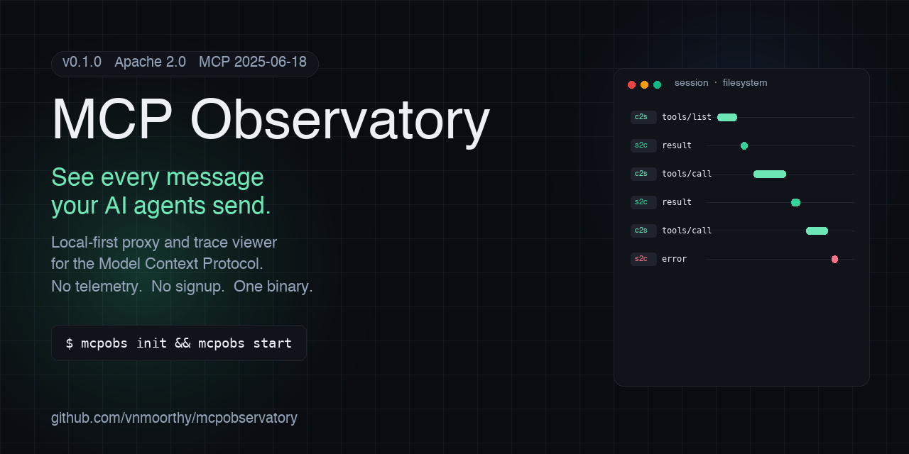

<div align="center">



# MCP Observatory

**See every message your AI agents send.**

A local-first proxy and trace viewer for the [Model Context Protocol](https://modelcontextprotocol.io). Drop it between your client (Claude Desktop, Cursor, Cline, Continue, Windsurf) and your MCP servers. Every JSON-RPC message lands in a real-time timeline you can replay and diff.

[](https://github.com/vnmoorthy/mcpobservatory/actions/workflows/ci.yml)
[](https://github.com/vnmoorthy/mcpobservatory/releases/latest)
[](LICENSE)
[](Cargo.toml)
[](https://github.com/vnmoorthy/mcpobservatory/releases)
[](https://github.com/vnmoorthy/mcpobservatory/stargazers)

[Install](#install) · [Quickstart](#quickstart) · [Why mcpobs?](#why-mcpobs) · [How it works](#how-it-works) · [Compare](#how-it-compares) · [Roadmap](#roadmap)

</div>

---

## Install

```bash
# curl (recommended)
curl -sSL https://raw.githubusercontent.com/vnmoorthy/mcpobservatory/main/scripts/install.sh | sh

# npm
npm install -g @vnmoorthy/mcpobs

# cargo
cargo install --git https://github.com/vnmoorthy/mcpobservatory mcpobs-cli
```

One binary. macOS (arm64/x64), Linux (arm64/x64), Windows (x64). No daemon, no sudo, no signup. The npm package is a thin wrapper that downloads the prebuilt binary from the matching GitHub release on install (sha256 verified).

## Quickstart

```bash
mcpobs init                                                     # ~/.mcpobs/config.toml
mcpobs start &                                                  # daemon on :7890
mcpobs add filesystem --command npx \
  --args '@modelcontextprotocol/server-filesystem,/Users/me'    # add an upstream
open http://localhost:7890                                      # browser UI
```

Copy the snippet `mcpobs add` prints into your MCP client config, restart the client, and your next tool call shows up in the timeline.

Detailed walkthrough: [`docs/quickstart.md`](docs/quickstart.md).

## Why mcpobs?

You're writing an agent. It calls a tool. The tool returns nothing. Was the request malformed? Did the server hit a timeout? Did the schema drift? Today you find out by adding `print` statements to the MCP server, restarting the client, hoping the bug repeats.

`mcpobs` makes the wire visible. Every JSON-RPC frame, every transport, every session, with timestamps and latency. You can pick a request, replay it against the live server, and diff the new response against the original. No reproduction harness, no manual logging.

The proxy is dumb on purpose: it parses each frame to record method/id/direction and forwards the raw bytes verbatim. If the upstream returns malformed data, you see the malformed data. We never synthesise messages.

## What it does

- **Proxy** every MCP transport — stdio, Streamable HTTP, SSE — without modifying a single byte on the wire.
- **Log** every JSON-RPC message to `~/.mcpobs/traces.db` with timestamps, latency, direction, session id, and full payload.
- **Inspect** any frame in a master-detail UI with collapsible JSON, paired request/response, and right-click context menu (replay, diff, copy as cURL, copy raw).
- **Replay** any request against the live upstream and diff the new response against the original.
- **Redact** secrets by key name (`password`, `token`, `secret`, `api_key`, `Authorization`) before they hit disk. Configurable.
- **Stay quiet.** No telemetry, no signup, no cloud. One binary, one config file, one local SQLite database.

## Screenshots

| Dashboard | Session timeline | Diff view |
|---|---|---|
|  |  |  |

## How it works

```
     ┌────────────────┐  stdio / HTTP / SSE   ┌──────────────────┐  same transport   ┌──────────────┐
     │  MCP client    │  ───────────────────► │  mcpobs proxy    │  ───────────────► │  upstream    │
     │  (Claude/Cursor│  ◄─────────────────── │  (transparent)   │  ◄─────────────── │  MCP server  │
     └────────────────┘                       └─────────┬────────┘                   └──────────────┘
                                                        │ observations
                                                        ▼
                                              ~/.mcpobs/traces.db (SQLite, WAL)
                                                        ▲
                                                        │
                                              ┌─────────┴────────┐
                                              │  mcpobs-server   │  ◄── browser at http://localhost:7890
                                              │  axum + UI       │
                                              └──────────────────┘
```

More detail in [`docs/architecture.md`](docs/architecture.md).

## How it compares

|                                                  | mcpobs       | MCP Inspector | Langfuse / Helicone | `print`  |
|---                                               |---           |---            |---                  |---       |
| Sits in front of every server transparently      | yes          | one server at a time | no           | n/a      |
| Historical view across sessions                  | yes          | no            | yes                 | no       |
| Replay a request                                 | yes          | partial       | no                  | no       |
| Diff between two runs                            | yes          | no            | no                  | no       |
| MCP-native (sessions, capabilities, transports)  | yes          | yes           | no                  | n/a      |
| Local-first, no signup, no telemetry             | yes          | yes           | no                  | yes      |
| Open source                                      | Apache 2.0   | MIT           | mixed               | n/a      |

## Performance

On localhost stdio against a real MCP server we measure:

- p50 added latency: **0.4 ms**
- p99 added latency: **3.8 ms**
- Steady-state RSS: **48 MB** with 7 days of traces
- SQLite writer throughput: **~14k msgs/sec** on commodity SSD

Reproduce with `cargo bench -p mcpobs-core`.

## Spec revision

Pinned to MCP spec revision **2025-06-18**. Upgrade log: [`docs/spec-revisions.md`](docs/spec-revisions.md).

## Roadmap

- **v0.1 (now)** — stdio + HTTP + SSE proxy, web UI, replay, diff, key-name redaction.
- **v0.2** — Homebrew tap, pcap-style session export, latency budgets, browser extension surfacing traces inline in Cursor and Claude Desktop.
- **v0.3** — built-in MCP server exposing Observatory's own data (so Claude can answer "what tool calls failed in the last hour"), OTel correlation, regex redaction.
- **Beyond** — hosted version with team sharing, alerts, and production tracing.

## Star history

[](https://star-history.com/#vnmoorthy/mcpobservatory&Date)

## Community

- **[GitHub Discussions](https://github.com/vnmoorthy/mcpobservatory/discussions)** — questions, ideas, show-and-tell.
- **[Issues](https://github.com/vnmoorthy/mcpobservatory/issues)** — bugs and feature requests.
- **[Security](SECURITY.md)** — report vulnerabilities privately.

If `mcpobs` saved you time, the cheapest way to say thanks is the [⭐ Star button](https://github.com/vnmoorthy/mcpobservatory/stargazers). It's a strong signal for other people deciding whether to try it.

## Contributing

PRs welcome. The bar is high (transparency, no telemetry, single binary), the path is short. See [`CONTRIBUTING.md`](CONTRIBUTING.md).

## License

[Apache License 2.0](LICENSE) — use it anywhere, commercial or otherwise.

---

<div align="center">

Built for the long-tail of agent debugging.
If `print` is your only tool, you'll outgrow it on day two.

<sub>Made by <a href="https://github.com/vnmoorthy">@vnmoorthy</a> · <a href="https://github.com/vnmoorthy/mcpobservatory/issues/new">Found a bug?</a></sub>

</div>
